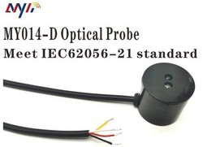
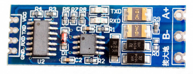
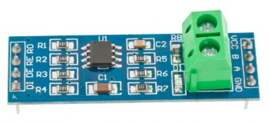

Компонент требует тестирования с разными счетчиками - пишите на anton.viktorov@live.com

# ESPHome компонент для считывания показаний со счетчиков электроэнергии ГОСТ МЭК/IEC 61107-2011 (type C) через оптопорт или RS-485

* [1. Назначение](#1-назначение)
* [2. Отказ от ответственности](#2-отказ-от-ответственности)
* [3. Функции](#3-функции)
* [4. Принцип работы](#4-принцип-работы)
* [5. Подключение](#5-подключение)
* [6. Настройка основного компонента](#6-настройка-основного-компонента)
* [7. Настройка сенсоров для опроса счетчика](#7-настройка-сенсоров-для-опроса-счетчика)
* [8. Примеры готовых конфигураций](#8-примеры-готовых-конфигураций)
* [8.1 НЕВА](#8-1-нева)
* [9. Проблемы, особенности, рекомендации](#10-проблемы-особенности-рекомендации)

## 1. Назначение
Компонент для считывания данных с приборов учета (ПУ) электроэнергии, воды, газа и пр., поддерживающих протокол стандарта **МЭК/IEC 61107-2011** или **IEC 62056-21**.

**Примечание:** Начиная с 2017 года МЭК 61107 заменен более современным стандартом **СПОДЭС** на основе стэка DLMS/COSEM. Компонент для работы с новым стандартом тут: https://github.com/latonita/esphome-dlms-cosem.

## 2. Отказ от ответственности
Пользуясь данным ПО пользователь полностью берет на себя всю ответственность за любые последствия.
 
## 3. Функции
- подключение как безадресное (широковещательный запрос), так и по адресу (9 последних цифр заводского номера),
- работа с несколькими ПУ на одной шине RS485,
- работа с несколькими шинами RS485,
- индивидуальна настройка сенсоров под конкретные запросы,
- работа с массивом возвращаемых значений,
- два вида сенсоров: числовой и текстовый,
- проверена работа RS-485 только на скорости 9600 бод,
- работа по оптопорту согласно протоколу - 300 бод, затем 9600 бод, либо сразу на 9600 бод

## 4. Принцип работы
Требуется подключение по оптопорту (или rs485 или can и т.д.). Настраиваеются общие параметры подключения к ПУ, а также набор сенсоров для считывания. Компонент поддерживает работу по протоколу МЭК 61107 в режиме C.
В данном режиме работа идет по принципу запрос-ответ. Для каждого сенсора указывается запрос к регистру в виде OBIS кода в общем случае (`A-B:C.D.E*F`), а в частном - каждый производитель делает всё немного по-разному. Требуется ознакомиться с документацией на ПУ.

### Пример отображения в home-assistant
 

## 5. Подключение
Устройства:
- микроконтроллер Esp (работа провена на модулях на базе esp32, esp32s, esp32s2, esp8266)
  - если испольуется UART0, то в модуле логгера нужно отключать вывод в порт (baud_rate:0)
- оптопорт TTL-IR (не USB!)
- или модуль трансивера RS485,
  - должен быть расчитан на 3.3 вольта (связка Esp + модуль на max485 расчитаный на 5 вольт может работать некорректно)
  - запитываем либо от esp модуля, либо отдельно, земля общая
- счетчик электрической энергии
  - A+ и B- соединяем с модулем
    - желательно подключение витой парой (А и В переплетены между собой) 
    - земли счетчика и модуля 485 *не соединяем*, а если кабель с экраном/оплеткой - можно соеденить с землей только со стороны модуля для уменьшения наводок
    - если расстояние до счетчика большое, то может понадобиться терминирующий резистор 120 Ом между A и B
  - пользуемся документацией на счетчик для уточнения схем подключений

### 5.0 Подключение через оптопорт
Подключение через оптопорт - самый простой вариант, не требует одобрения сбытовой организации и снятия пломб с ПУ для подключения к порту rs485. С другой стороны, оптоголовку необходимо приобрести или собрать самостоятельно, да и не во всех электрощитках можно закрыть крышку при установленной оптоголовке.

Протестирована работа с головкой MY014-D

```
┌───────┐           3.3В     ┌─────────────┐  ┌────────────────┐
│       │            └── VCC ┤             │  │                │
│  MCU  ├ RX ──────────── RX ┤  TTL to IR  ├  ┤ Электросчетчик │
│ ESPxx ├ TX ──────────── TX ┤   module    ├  ┤                │
│       │                    │             │  │                │
│       │                    │             │  ┤                │
│       ├ GND ────────── GND ┤             │  ┤                │
└───────┘                    └─────────────┘  └────────────────┘
```

### 5.1 Рекомендуемый вариант подключения с RS-485 модулем с автоматическим выбором направления передачи 
На данный момент в продаже много модулей RS-485 с расширеным набором функций - с логикой автоматического выбора направления передачи, защитными диодами и предохранителями. 
Эти модули рекомендуются к использованию, т.к. более надежны.  
Например, модуль XY-017


```
┌───────┐           3.3В     ┌─────────────┐                 ┌────────────────┐
│       │            └── VCC ┤             │                 │                │
│  MCU  ├ RX ──────────── RX ┤ RS485<->TTL ├ A ───┐─┐─┐─── A ┤ Электросчетчик │
│ ESPxx ├ TX ──────────── TX ┤   module    ├ B ───└─└─└─── B ┤                │
│       │                    │             │                 │                │
│       │                    │             │          ┌─── + ┤                │
│       ├ GND ────────── GND ┤             │      9-12В ── - ┤                │
└───────┘                    └─────────────┘                 └────────────────┘
```
Иногда RX/TX на модуле перепутаны - ничего страшного, просто меняем.

### 5.2 Вариант подключения с классическим RS-485 модулем с 4 входами
Классический модуль с RO/DI/DE/RE входами + общая земля. MAX485 расчитан на 5В, а MAX3485 на 3.3В, хотя первый в 90% случаев прекрасно работает и от 3.3В тоже.

- ``RO`` - прием, 
- ``DI`` - передача, 
- ``DE + R̅E̅``  - контроль линии для передачи данных (`flow_control_pin` в yaml) 



```

┌───────┐           3.3В     ┌─────────────┐                 ┌────────────────┐
│       │            └───VCC ┤             │                 │                │
│  MCU  ├ RX ──────────── RO ┤ RS485<->TTL ├ A ───┐─┐─┐─── A ┤ Электросчетчик │
│ ESPxx ├ TX ──────────── DI ┤   module    ├ B ───└─└─└─── B ┤                │
│       ├ FLOW ──────┬─── RE ┤             │                 │                │
│       │            └─── DE ┤             │          ┌─── + ┤                │
│       ├ GND ────────── GND ┤             │      9-12В ── - ┤                │
└───────┘                    └─────────────┘                 └────────────────┘
```
### 5.3 Подключение нескольких счетчиков
Подключение нескольких счетчиков возможно двумя способами:
- Подключение к одной шине RS485 - самый простой вариант, просто необходимо параллельно подключить счетчики к одной шине: соединить А c А, B с B
```
     ┌─────┐    ┌─────┐         ┌─────┐
     │ # 1 │    │ # 2 │  ...    │ # N │
     │ A B │    │ A B │  ...    │ A B │
     └─┬─┬─┘    └─┬─┬─┘         └─┬─┬─┘
       │ │        │ │             │ │
  ─ A ─┴──────────┴───── ... ─────┘ │
  ─ B ───┴──────────┴─── ... ───────┘

```
- Подключение к разным шинам RS485 - нужно подключать два модуля RS485.

## 6. Настройка основного компонента
Подлючаем внешний компонент из репозитория
```yaml
external_components:
  - source: github://latonita/esphome-iec61107-meter
    refresh: 30s
    components: [iec61107]
```
Смотрим документацию к ПУ. По стандарту МЭК 61107 для оптопорта 300 бод 7е1, далее переключение на 9600.
RS485 не требует переключений, сразу работает на 9600.
:
```yaml
uart:
  rx_pin: GPIO16
  tx_pin: GPIO17
  baud_rate: 300
  data_bits: 7
  parity: EVEN
  stop_bits: 1
```

Основной модуль (hub)
```yaml
iec61107:
  id: neva-mt
  update_interval: 30s
  baud_rate_handshake: 300   # стартовая скорость оптопорта, при работе с rs485 поставить необходимую (9600)
  receive_timeout: 3000ms    # время ожидания ответа от счетчика
  crc_method: SUM7           # Метод расчета контрольной суммы SUM7 или XOR
#  programming_mode: false        # Некоторые требуют формального входа в режим программирования
#  password: "00000000"           # и указания пароля (в Неве, по-умолчанию, "00000000")
#  address: 123456789             # обязательно, если несколько устройств на одной шине
#  delay_between_requests: 100ms  # задержка между запросами к счетчику
#  flow_control_pin: GPIO32
#  uart_id: bus_01               
```
- `address` - по-умолчанию пустой, если счетчик один - то адрес не требуется. Если несколько счетчиков - то там указываем его адрес - это последние 9 цифр его заводского номера.
- `receive_timeout` - по-умолчанию 500мс, если ответы длинные - то можем не успеть дождаться ответа - увеличиваем. для оптопорта нужно брать 2-3 с
- `delay_between_requests` - по-умолчанию 100мс, иногда счетчик может тупить после больших запросов и не успевает принять новый - увеличиваем. **важно** - больше 1.5с не рекомендую, в счетчиках есть таймаут от 1.5с до 3с - если их не дергают, они считают, что общение закончено и закрывают сессию.
- `flow_control_pin` - указываем, если 485 модуль требует сигнал направления передачи RE/DE 
- `uart_id` - если использьзуете несколько портов UART, указать его id

## 7. Настройка сенсоров для опроса счетчика
Реализованы два типа сенсоров:
- `sensor` - числовые данные, float
- `text_sensor` - текстовые данные в формате "как пришли от счетчика"
```yaml
sensor/text_sensor:
  - platform: iec61107
    # iec61107_id: neva324   # обязательно, если несколько счетчиков
    name: Название сенсора ЛАТИНИЦЕЙ!!
    obis_code: Код ОБИС согласно документации к ПУ.
    index: индекс ответа, по-умолчанию 1
    sub_index: суб-индекс внутри ответа, по-умолчанию 0 = весь ответ из скобок
    ... остальные стандартные параметры для сенсора ...
```

OBIS коды более-менее стандартизованы, но производители не всё поддерживают и иногда используют свои модификации.
Уточняем коды для запроса в документации на счетчик, либо из логов родной утилиты. 

В общем случае код представлен в виде `A-B:C.D.E*F`. При этом в документации A,B,F могут быть не указаны.
Запись кодов может отличаться, иногда пишут `1-0:15.8.1*255`, иногда `1.0.15.8.1.255`.

Обычно, код OBIS выглядит, например, для частоты сети так: `1-0:14.7.0:255`. Производители часто первые две цифры опускают и указывают `14.7.0:255`. или даже опускают последний `255`, и получается `14.7.0`.

Также допускается запись в шестнадцатиричном формате.
Например, производитель `Тайпит` для счетчиков указывает OBIS код в шестнадцатиричном формате и использует 4 цифры. Для частоты сети это `0E0701FF`, что соответствует коду `14.7.1*255`, а точнее `1-0:14.7.1*255`.

Производитель _Энергомера_ для разных моделей использует разные кодировки, вместо OBIS кодов использует свои названия функций. Например, `ET0PE`.

Если запрос возвращает несколько значений, то, по-умолчанию, берется первое, но можно выбрать указав номер ответа (индекс, начинается с 1). Если в скобках указано несколько значений через запятую, то
можно указать какое именно брать (суб-индекс, начинается с 1).
Примеры запросов и ответов от счетчика:
| Счетчик | Запрос | Ответ счетчика | Индекс | Суб-индекс | Результат |
|--|--|--|--|--|--|
| xxx    | `32.7.0()` | `32.7.0(226.70)`| не указан | не указан | 226.70 |
| xxx    | `32.7.0()` | `32.7.0(226.70)`| 1 | не указан | 226.70 |
| xxx    | `XXX()` | `XXX(123)XXX(345,678)`| 1 | 1 | 123 |
| xxx    | `XXX()` | `XXX(123)XXX(345,678)`| 2 | 2 | 678 |
| НЕВА-324-МТ    | `0F0880FF()` | `0F0880FF(020044.63,015023.90,005020.73,000000.00,000000.00)`| не указан | не указан | ошибка, нужно указать sub_index |
| НЕВА-324-МТ    | `0F0880FF()` | `0F0880FF(020044.63,015023.90,005020.73,000000.00,000000.00)`| 1 | 2 | 15023.90 |

Запросы берем из руководств на счетчики.

### 7.3 Пример. Несколько счетчиков на одной шине
Можно опрашивать несколько устройств на одной шине, необходимо **обязательно** указывать адрес счетчика.
В противном случае счетчики начнут отвечать одновременно и процесс считывания данных будет нарушен.

```yaml
uart:
    id: bus_1
    rx_pin: GPIO4
    tx_pin: GPIO5
    baud_rate: 9600
    data_bits: 7
    parity: EVEN
    stop_bits: 1

iec61107:
  - id: meter_01
    uart_id: bus_1
    address: 123456001
  - id: meter_02
    uart_id: bus_1
    address: 123456002

sensor:
  - platform: iec61107
    iec61107_id: meter_01
    obis_code: xxx
    name: xxx1

  - platform: iec61107
    iec61107_id: meter_02
    obis_code: xxx
    name: xxx2
```

## 8. Примеры готовых конфигураций
Важный момент - при компиляции Esphome заменяет все не-латинские символы на `_`.
И если попадутся два сенсора с одинаковыми названиями с учетом замен - то Home Assistant будет смешивать их данные.
**Крайне рекомендую в yaml писать на английском/латинице, а уже в HASS переименовывать на русский**.

<details><summary>Для однофазного счетчика НЕВА 324 МТ, подключение по оптопорту</summary>

* [Скачать полный конфиг neva-324-mt.yaml](neva-324-mt.yaml)

```yaml

# Выжимка из конфига, скачайте полный файл neva-324-mt.yaml, в нем десятки сенсоров

esphome:
  name: neva-324-mt

esp32:
  board: esp32dev
  framework:
    type: arduino

external_components:
  - source: github://latonita/esphome-iec61107-meter
    refresh: 30s
    components: [iec61107]

uart:
  rx_pin: GPIO16
  tx_pin: GPIO17
  baud_rate: 300              # для rs485 поменяйте на 9600
  data_bits: 7
  parity: EVEN
  stop_bits: 1


iec61107:
  - id: meter_01
    update_interval: 30s
    receive_timeout: 3000ms
    baud_rate_handshake: 300  # Оптопорт начинает работу с 300 бод, для rs485 - обычно 9600
    programming_mode: true    # Счетчики НЕВА требуют формального входа в режим программирования
    password: "00000000"      # и указания пароля (по-умолчанию "00000000")
    crc_method: XOR           # Метод расчета контрольной суммы в Неве - XOR

sensor:
  - platform: iec61107
    obis_code: 0F0880FF     # Ответ от счетчика 0F0880FF(020044.63,015023.90,005020.73,000000.00,000000.00)
    index: 1                # Берем первые скобки
    sub_index: 1            # Первое значение из списка: 020044.63
    name: Energy Total
    unit_of_measurement: kWh
    accuracy_decimals: 0
    device_class: energy
    state_class: total_increasing

- platform: iec61107
    obis_code: 0F0880FF     # Такой же код как и выше, но нужно вытащить другое значение
    index: 1                # Тоже берем первые скобки
    sub_index: 2            # Теперь берем второе значение из списка: 015023.90
    name: Energy T1
    unit_of_measurement: kWh
    accuracy_decimals: 0
    device_class: energy
    state_class: total_increasing

  - platform: iec61107
    obis_code: 0F0880FF
    index: 1
    sub_index: 3
    name: Energy T2
    unit_of_measurement: kWh
    accuracy_decimals: 0
    device_class: energy
    state_class: total_increasing

# ...

text_sensor:
  - platform: iec61107
    name: Serial number
    obis_code: 600100FF
    entity_category: diagnostic

```

</details>

<details><summary>Для однофазного счетчика Нева 124 МТ</summary>

* [Скачать конфиг neva-124-mt.yaml](neva-124-mt.yaml)


</details>

<details><summary>Для счетчика LUNA</summary>

* [Скачать конфиг luna.yaml](luna.yaml)

Необходимо тестировать подключение к ЛУНЕ

</details>


## 10. Проблемы, особенности, рекомендации
- "да должно всё работать" :)
- основная проблема - неверно выбранное питание/модуль для 485. еще достаточно часто модули встречаются нерабочие.
- при слабом сигнале wifi, esp может терять точку доступа и часто заново подключаться. А если esp одноядерная (например, esp8266 или esp32s2), то это может влиять на сбор данных со счетчика и, в целом, может приводить к неожиданным перезагрузкам
- по идее, hardware uart всегда надежнее, но, в целом, software uart и на esp8266 работает без сбоев, если не делать запросы, которые возвращают кучу данных
- забавно, что у кого-то бывает работает только software uart, у кого-то - только hardware uart, у многих - и так и так
- модуль 485 желательно брать с защитными диодами - наблюдали как умершую esp8266, так и модуль, у которого работала только отправка, а прием не работал
- модули 485 с маркировкой пинов rx/tx - иногда rx/tx наоборот :)
- внимательно смотрите на номера пинов на esp - ориентируйтесь на распиновку модулей (pinout diagram). Часто производители нумеруют пины на плате совсем не так, как они пронумерованы на чипе esp (например, nodemcu). Указывайте номера, как на чипе (GPIOxx)
- при подключении нескольких счетчиков на одну шину - опрос происходит последовательно
- при подключении нескольких счетчиков на разные шины - опрос может происходить параллельно и если используется SoftwareSerial, то могут появляться ошибки при считывании, рекомендуется использовать esp32 и только HardwareSerial
